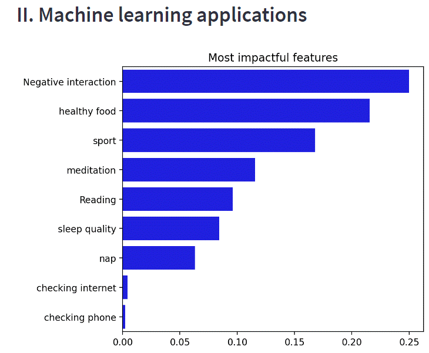
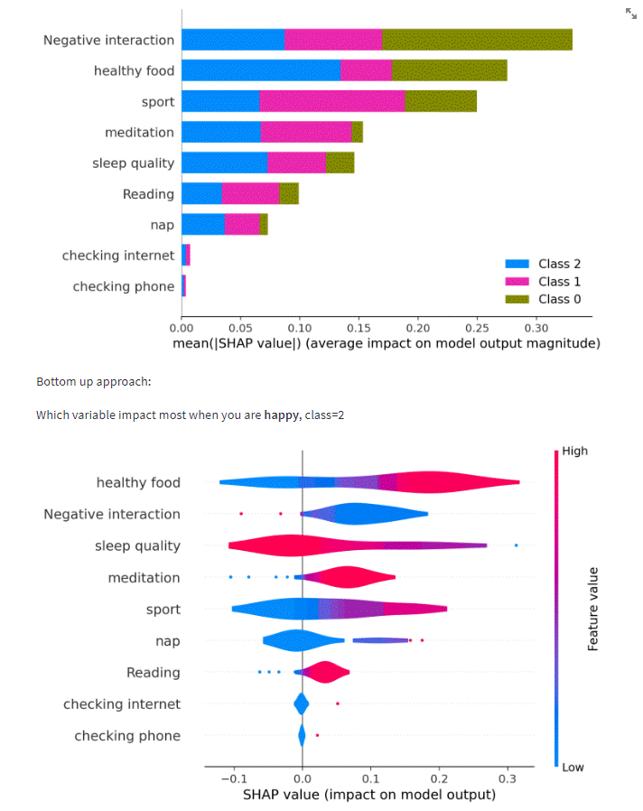

HOW TO HACK YOUR WELLNESS POWERED BY A.I
==========

Based on your daily actions, we will determine with machine learning algorithm what influence most the variable of your choice (happiness, productivity, anxiety)

Exemple below of what the web-application look like:

Environment setup
-----------------

#. Clone the repository::

    git clone ...

#. Create a virtual environment::

    poetry shell

#. Install the package and dependencies ::

    poetry install
   
#. Go in the folder and run the app::

    poetry run streamlit run main_page.py

    
    
## TO DOS
- [ ] Make appear the decision Tree as an exemple. (explain which algorithm is behind)

- [ ] full descriptive analytics,Build another page statsitic : distrib pf hapiness : are zyou happy? over the last month 3.
    - [x]  What is the activiy that is done the most, and what is the impact on the overall target? If you do something a lot but it does not make you happy what is the purpose? select lower and max values as highlight
    - [x]  how to categorise it 1 i good, 0 is neutral, -1 is bad.
- [ ] Additional features :  
    - [X] interaction sociale (friends)
    - [X] temps pour soi
    - [X] lecture 
    - [ ] faire une bonne action
    - [X] altercation (dispuste/extermal factor)
- [ ] For deeper analysis:
    - [X] make output between 0 1 2 recalculate a an average socre and scale it between 0 and 1. (divide by max-min)

- [x] Save image online version for README
- [ ] explain they can access to the version onlien and explain thez can install it locally as well etc...
- [ ] Run a optimized process through optuna
- [ ] Make a more complex model with Optuna and hyperparameter tuning when you have more data.
- [ ] Probably better to put everything related to data in the main page, including analytics.
- [ ] Deploy app online